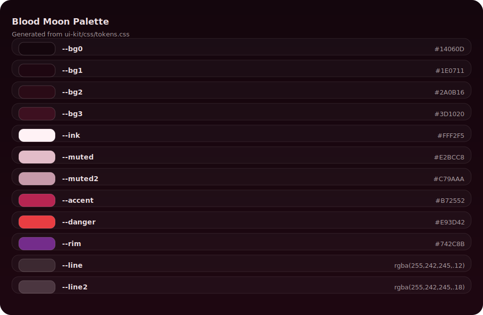

# Blood Moon UI (PLEX Minimal)

A **static, stealable UI kit** — no frameworks, no build steps, no dependencies.

Built by **Dorian Sotpyrc** for **plexdata.online**.

- Website: https://plexdata.online  
- Medium: https://medium.com/@doriansotpyrc

**Theme:** Blood Moon — premium dark, calm crimson accents, audit-grade readability.

---

## Preview


---

## Palette (from tokens.css)



Token-driven: swapping `ui-kit/css/tokens.css` re-skins most UI.

---

## Styling notes (minimal, explicit)

- **Not pure black:** wine/charcoal surfaces keep reds alive and reduce harsh contrast.
- **Crimson is sparse:** reserved for focus/active/danger (never always-on neon).
- **Audit readability:** thin borders, subtle surface layers, compact spacing.
- **Calm effects:** no heavy glass, no loud neon, minimal motion.
- **Accessibility:** `:focus-visible`, real `<label>`s, error text (not color-only), reduced motion respected.
- **Responsive:** mobile-first; navbar becomes a single dropdown trigger.

---

## Included elements (single page)

- Navbar (desktop links + mobile dropdown)
- Containers / cards / dividers
- Input boxes (focus / error / disabled)
- Buttons (primary / secondary / ghost / danger / icon / disabled)
- Badges + chips
- Styled list + audit rows
- Optional minimal table (scrollable on mobile)
- Palette + design decisions section in the kit page

---

## Folder

```

ui-kit/
index.html
css/
tokens.css
base.css
components.css
pages.css
js/
app.js
assets/
img/
hero.webp

```

---

## License

MIT
